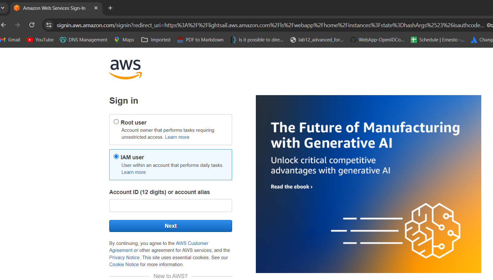
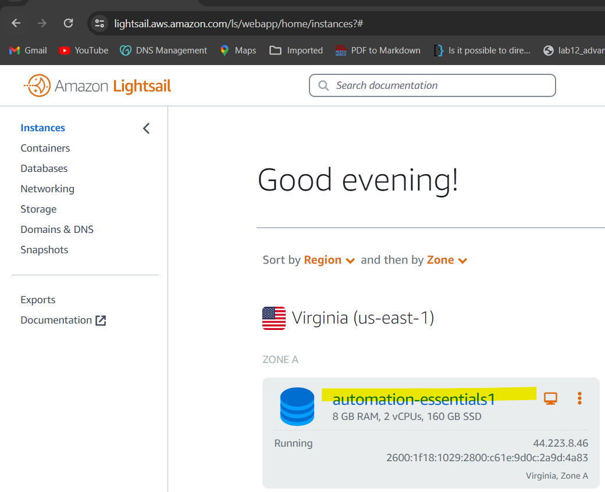
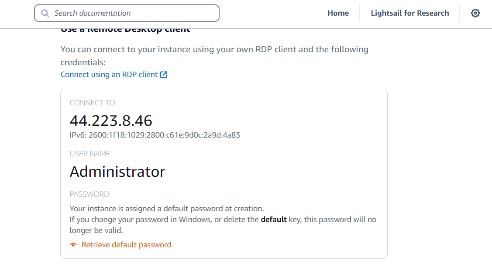
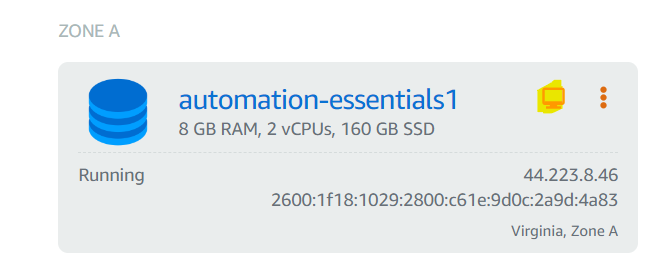

### Lab Environment Login Steps

Following are AWS login steps; follow these steps to login into AWS and then connect with lab environments using RDP client.

#### AWS Login Details:  

Sign-in URL: https://lightsail.aws.amazon.com/ls/webapp/home/instances

Click IAM User
 
**Account ID**: `Will be provided by Instructor`

**User name**: `Will be provided by Instructor`

**Password**: `Will be provided by Instructor`

Please refer to this instruction for accessing lab environment:

#### Connect using RDP Client

Click VM **assigned** to you to get the detail to connect using RDP client:

**Username:** `Administrator`

**Password:** Click Retrieve default password button

#### Connect using RDP Browser

If you don't have access to RDP client, you can connect using RDP Browser. Click `Screen` icon next to VM assigned to you.

**Note:** Windows Desktop will open in new browser. RDP browser will allow some VMs to connect at the same time.